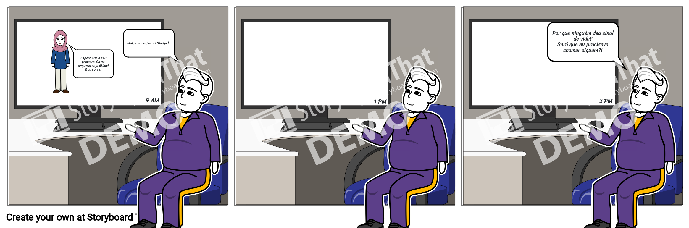
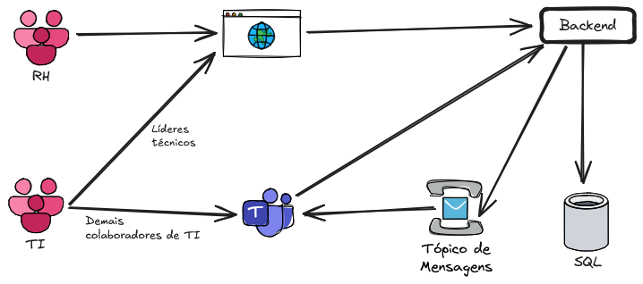
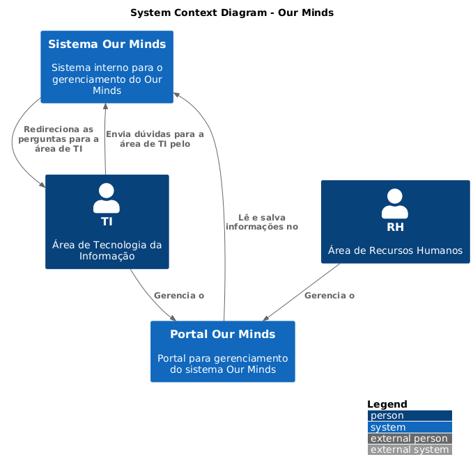
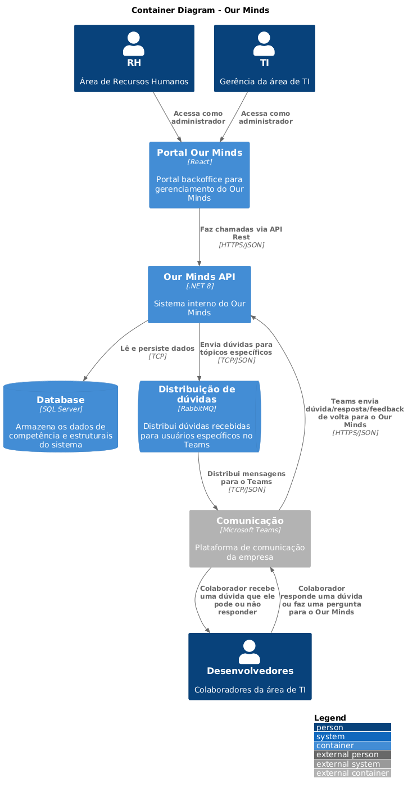
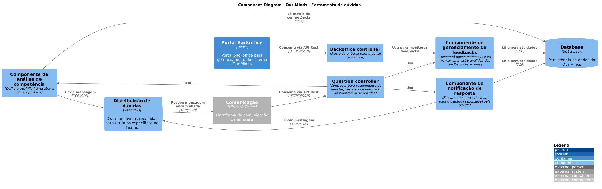

### Apresentação em vídeo

https://youtu.be/TRDDvUBLGBQ

### 1 - Problema
Com a consolidação do trabalho híbrido e remoto, a Class sofre com o seu atual processo de onboarding e gerenciamento de talentos. Os seus novos colaboradores muitas vezes se sentem perdidos durante os primeiros dias principalmente devido à falta de comunicação entre o time de RH, responsável por atender as vagas abertas, e as squads de desenvolvimento que podem nem estar sabendo que a sua vaga aberta foi preenchida e precisa entrar em contato com esse novo funcionário. A equipe do RH pode não ter o contato direto pelo responsável da vaga e precisa depender de um gerente de tecnologia sobrecarregado para direcionar a nova contratação.
Além disso, com o número de colaboradores especializados em diferentes stacks de tecnologia, os próprios funcionários da Class dependem de uma comunicação bagunçada para tirar dúvidas, como mandar uma pergunta em um grupo dos funcionários e tal pergunta se perder até ser vista por quem realmente poderia ajudar. Fora o tempo gasto procurando, pessoa por pessoa, quem tem aquela informação específica para desbloquear o impedimento de uma equipe. Se fez necessário pensar em uma solução para cobrir esses dois problemas e agilizar o dia-a-dia dentro da empresa.



### 2 - O que esperamos aprender com esse projeto?
Principalmente, como sistematizar o processo de onboarding para reduzir ao máximo a proatividade humana para a evolução do processo, e como automatizar a distribuição de perguntas e dúvidas para as pessoas interessadas/capacitadas com base em uma matriz de competência.
### 3 - Que perguntas precisamos que sejam respondidas?
- Quais são as atuais etapas do processo de onboarding?
- Quem é responsável por intermediar o pedido de novas vagas entre a área técnica e o time de RH?
- Como é a cultura de compartilhamento de conhecimento da empresa atualmente?
### 4 - Quais são os nossos principais riscos?
- Baixa adesão da ferramenta de gerenciamento de dúvidas
- Falta de informação acerca da padronização de acessos e licenças para novos funcionários
### 5 - Crie um plano para aprender o que precisamos para responder a perguntas específicas.
- Acompanhar um processo de contratação de ponta a ponta, desde a especificação da vaga pelo líder técnico para o time de RH, etapas de entrevista e quem participa dessas entrevistas, escolha e processo de contratação junto ao RH, solicitação de acessos e licenças e processo de onboarding. Dessa forma, entendendo e mapeamento todo o processo contratual da empresa e identificando quais etapas podem ser incorporadas para dentro do Our Minds.
- Elaborar e distribuir uma pesquisa informativa anônima junto aos desenvolvedores para coletar feedbacks sobre as dores sentidas durante o próprio onboarding e como é o dia-a-dia da equipe e como os problemas e dúvidas são resolvidas
- Acompanhar algumas squads de desenvolvimento durante reuniões de planejamento e stand-ups para mensurar e identificar a coesão entre os colaboradores.
### 6 - Crie um plano para reduzir riscos.
- Fasear o desenvolvimento do projeto, focando em entregar uma primeira versão que de imediato cause um grande impacto e seja amplamente adotada pela empresa, implementações subsequentes podem ser facilitadas assim que a gerência perceba o ganho que a empresa está tendo com a implementação do projeto
- Para burlar a baixa adesão dos desenvolvedores, podemos facilitar a interface da plataforma de compartilhamento de dúvidas, transformando-a em uma extensão de um software que eles já usam. Implementando o core da nossa ferramenta dentro do Teams, podemos reduzir e muito o impacto inicial dos funcionários utilizarem a ferramenta, já que não será mais um portal com login que eles precisam acessar, e sim um chat no Teams que eles podem abrir e já ir interagindo com a plataforma
### 7 - Quem são as partes interessadas?
Os key stakeholders são: Gerente de RH e gerente de TI. O projeto irá impactar diretamente o dia-a-dia de trabalho das suas respectivas áreas, logo é essencial que ambos estejam diretamente associados ao direcionamento que o projeto irá tomar. Além disso, é importante que ambos sejam a ponte entre o time de arquitetura e o usuário final da plataforma, de forma que as dores e resistências sejam previamente anotadas. 
### 8 - O que eles esperam ganhar?
É esperado que o projeto aumente a visibilidade que a gestão tem da sua base de conhecimento, facilitando a reorganização interna de colaboradores em áreas de desenvolvimento que mais atendam as suas habilidades técnicas. Além de servir como um sistema orgânico que seja absorvido pela rotina diária da empresa e se torna uma ferramenta de compartilhamento de informação e feedback positivo internamente.
### 9 - Quem são os usuários?
A principal área beneficiada pelo projeto será a área de RH, que contará com indicadores chave de competência da sua empresa e um fluxo contínuo de feedback dos próprios colaboradores entre si, o que pode ser usado para medir o nível de satisfação geral dos funcionários com a empresa ou servir de indicadores para premiações e bonificações.
A área de TI também será beneficiada pois contará com uma ferramenta única no mercado para aumentar a sinergia e colaboração entre os funcionários.
### 10 - O que eles estão tentando realizar?
O objetivo desse projeto é centralizar a base de conhecimento da empresa e oferecer uma ferramenta útil para incentivar o compartilhamento de conhecimento entre os colaboradores através de uma interface que faça uso dessa base de conhecimento para redirecionar dúvidas e questões para os usuários com capacidade para responde-las.
### 11 - Qual o pior que pode acontecer?
- Os colaboradores continuem se contatando diretamente sem usufruir do sistema
- Líderes técnicos e gestores de RH burlem a nova plataforma para evitar burocracia
- Os colabores vejam a plataforma de competência como uma 'obrigação' por parte do RH e se sintam intimidados ou coagidos a preencher competências falaciosas
### 12 - Desenhe uma arquitetura (Modelo Freeform - Versão inicial);

#### Premissas:
```
O RH usará para:
	gerenciamento de competência dos funcionários
	Base de dados para vagas ????
	Análise de feedback colaborativo (com base na ferramenta de Q&A)

O TI usará para:
	Gerenciamento de competência dos funcionários (visão líderes técnicos)
	Q&A Colaborativo:
		- Quem pergunta, adiciona tags referentes à dúvida
		- Pergunta é direcionada aos usuários com as competências informadas na tag
		- Usuário pega uma pergunta da fila no seu tempo livre e responde
		- Quem pergunta recebe a resposta e pode dar um feedback para quem respondeu
		- RH pode aplicar uma gamificação com base nos funcionários que mais colaboraram no Q&A
```

#### Arquitetura:



### 13 - Faça uma descrição de cada um dos componentes que você desenhou;

Portal backoffice:
	Será usado pela equipe de RH e líderes técnicos de TI para gerenciar a matriz de competência dos funcionários da empresa, além de acompanhar métricas da plataforma de colaboração e gerenciar o perfil de vagas, repassando o feedback de possíveis candidatos para os líderes responsáveis pelas vagas.
Backend:
	Será responsável por gerenciar a plataforma de competência controlada pelo backoffice, além de gerenciar o sistema de colaboração entre usuários, recebendo dúvidas e aplicando a sua lógica de negócio em conjunto com a matriz de competência salva no banco de dados para definir para quais usuários receberão a dúvida criada através da fila de mensageria.
Fila de mensageria:
	Parte essencial dessa arquitetura, os tópicos da fila de mensageria serão responsáveis por redirecionar as dúvidas abertas nas plataformas para os usuários com base na matriz de competência, o backend irá alimentar os tópicos com base nessa lógica de negócio, e a fila será responsável por encaminhar a mensagem para o perfil de cada usuário na plataforma do Microsoft Teams, canal por onde a vasta maioria dos colaboradores da empresa terão contato com a plataforma.
Microsoft Teams:
	A arquitetura irá utilizar a atual plataforma de comunicação da empresa para implementar, através de uma extensão, o portal colaborativo para os seus funcionários. Tanto o envio de perguntas quando as respostas e o feedback serão feitos através do Teams.
### 14 - Descreva requisitos que você (s) considera importante e por quê?
- Matriz de competência - É essencial que o sistema seja alimentado com uma base de competência atualizada de todos os colaboradores da empresa para que a plataforma de dúvidas colaborativas seja eficaz no seu papel;
- Extensão para o Microsoft Teams - Grande parte da empresa terá contato com o novo sistema através de uma extensão no Teams, foi escolhido utilizar a plataforma de comunicação existente da empresa para não sobrecarregar os colaboradores com mais uma ferramenta na sua rotina, dessa forma, a comunicação entre o Our Minds e eles será tão fácil quanto mandar uma mensagem para um novo contato via Teams;
- Fila de mensageria - Como parte do conceito de se utilizar a matriz de competência para distribuir as dúvidas com base no conhecimento dos colaboradores, a mensageria é essencial para que seja possível criar tópicos específicos onde vários usuários com a competência em Linux, por exemplo, sejam notificados no Teams sobre a dúvida em aberto;
### 15 - Sobre o que o diagrama ajuda você a raciocinar/pensar?
O diagrama acima deu uma clareza sobre como simplificar a implementação da stack para executar a ideia e permitiu que a equipe focasse no algorítmo para gerenciar a plataforma colaborativa utilizando a matriz de competência, além de ajudar o time a resolver possíveis problemas de conceito com a ideia.
### 16 - Quais são os padrões essenciais no diagrama?
O principal padrão de arquitetura que será aplicado no projeto é o Pub-Sub (Publisher-Subscriber) pois será essencial que uma dúvida postada dispare uma notificação para todos os usuários capazes de responde-la.
### 20 - O diagrama está completo?
Sim, a solução encontrada na arquitetura atendeu as expectativas de implementação da ideia.
### 21 - Poderia ser simplificado e ainda assim ser eficaz?
Não seria possível simplificar a arquitetura pois ela em si já está bem enxuta e traz consigo apenas o conceito básico para se entender como a infraestrutura da plataforma será executada.
### 22 - Houve alguma discussão importante que vocês tiveram como equipe?
A única decisão foi acerca de seguir com a ideia de quebrar os canais de acesso à plataforma entre o portal backoffice para a gerência e a extensão do Teams para os demais colaboradores da empresa, por fim vimos que a escolha mais segura para garantir que a implementação do projeto seja tranquila foi optando pela arquitetura voltada para o Teams.
### 26 - Desenhe 3 Arquiteturas com o projeto que você desenvolveu na aula em cada uma das camadas do C4;
### 27 - Nível Contexto


```plantuml
@startuml context
 
!include https://raw.githubusercontent.com/plantuml-stdlib/C4-PlantUML/master/C4_Context.puml
 
LAYOUT_WITH_LEGEND()
 
title System Context Diagram - Our Minds
 
System(backend, "Sistema Our Minds", "Sistema interno para o gerenciamento do Our Minds")
System(backoffice, "Portal Our Minds", "Portal para gerenciamento do sistema Our Minds")
Person(rh, "RH", "Área de Recursos Humanos")
Person(ti, "TI", "Área de Tecnologia da Informação")

Rel(rh, backoffice, "Gerencia o")
Rel(ti, backoffice, "Gerencia o")
Rel(backoffice, backend, "Lê e salva informações no")
Rel(ti, backend, "Envia dúvidas para a área de TI pelo")
Rel(backend, ti, "Redireciona as perguntas para a área de TI")
@enduml
```
### 28 - Nível Container


```plantuml
@startuml context
!include https://raw.githubusercontent.com/plantuml-stdlib/C4-PlantUML/master/C4_Container.puml
 
LAYOUT_WITH_LEGEND()
 
title Container Diagram - Our Minds
 
Container(api, "Our Minds API", ".NET 8", "Sistema interno do Our Minds")
Container(front, "Portal Our Minds", "React", "Portal backoffice para gerenciamento do Our Minds")
ContainerDb(db, "Database", "SQL Server", "Armazena os dados de competência e estruturais do sistema")
ContainerQueue(queue, "Distribuição de dúvidas", "RabbitMQ", "Distribui dúvidas recebidas para usuários específicos no Teams")
Container_Ext(teams, "Comunicação", "Microsoft Teams", "Plataforma de comunicação da empresa")

Person(rh, "RH", "Área de Recursos Humanos")
Person(ti, "TI", "Gerência da área de TI")
Person(dev, "Desenvolvedores", "Colaboradores da área de TI")

Rel(rh, front, "Acessa como administrador", "")
Rel(ti, front, "Acessa como administrador", "")
Rel(front, api, "Faz chamadas via API Rest", "HTTPS/JSON")
Rel(api, db, "Lê e persiste dados", "TCP")
Rel(api, queue, "Envia dúvidas para tópicos específicos", "TCP/JSON")
Rel(queue, teams, "Distribui mensagens para o Teams", "TCP/JSON")
Rel(teams, dev, "Colaborador recebe uma dúvida que ele pode ou não responder", "")
Rel(dev, teams, "Colaborador responde uma dúvida ou faz uma pergunta para o Our Minds", "")
Rel(teams, api, "Teams envia dúvida/resposta/feedback de volta para o Our Minds", "HTTPS/JSON")
@enduml
```
### 29 - Nível Componente


```plantuml
@startuml component
!include https://raw.githubusercontent.com/plantuml-stdlib/C4-PlantUML/master/C4_Component.puml
 
LAYOUT_LANDSCAPE()
LAYOUT_WITH_LEGEND()
 
title Component Diagram - Our Minds - Ferramenta de dúvidas

Container(front, "Portal Backoffice", "React", "Portal backoffice para gerenciamento do sistema Our Minds")
Container_Ext(teams, "Comunicação", "Microsoft Teams", "Plataforma de comunicação da empresa")
ComponentDb(db, "Database", "SQL Server", "Persistência de dados do Our Minds")
ComponentQueue(queue, "Distribuição de dúvidas", "RabbitMQ", "Distribui dúvidas recebidas para usuários específicos no Teams")

Component(c_bo, "Backoffice controller", "Ponto de entrada para o portal backoffice")
Component(c_d, "Question controller", "Controller para recebimento de dúvidas, respostas e feedback da plataforma de dúvidas")
Component(competencia, "Componente de análise de competência", "Definirá qual fila irá receber a dúvida postada")
Component(resposta, "Componente de notificação de resposta", "Enviará a resposta de volta para o usuário responsável pela dúvida")
Component(feedback, "Componente de gerenciamento de feedbacks", "Receberá novos feedbacks e irá montar uma visão analítica dos feedbacks recebidos")

Rel(teams, c_d, "Consome via API Rest", "HTTPS/JSON")
Rel(front, c_bo, "Consome via API Rest", "HTTPS/JSON")
Rel(c_bo, feedback, "Usa para monitorar feedbacks")
Rel(feedback, db, "Lê e persiste dados", "TCP")
Rel(c_d, competencia, "Usa", "")
Rel(competencia, db, "Lê matríz de competência", "TCP")
Rel(competencia, queue, "Envia mensagem", "TCP/JSON")
Rel(queue, teams, "Recebe mensagem encaminhada", "TCP/JSON")
Rel(c_d, resposta, "Usa", "")
Rel(resposta, db, "Lê e persiste dados", "TCP")
Rel(resposta, queue, "Envia mensagem", "TCP/JSON")
Rel(c_d, feedback, "Usa", "")
@enduml
```
### 30 - Apresentação
[]